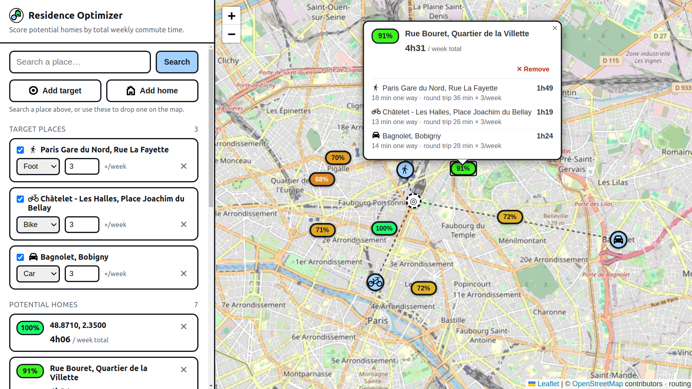

# Residence Optimizer

  <a href="https://residence-optimizer.tomansion.fr/">
    
  </a>

A web app to find the best place to live. Drop the places you regularly go
(work, gym, family…), set **how you travel** to each (car, bike, foot, transit)
and **how often per week**, then drop candidate homes on the map. Each home is
ranked by **total weekly commute time**.



## Usage

1. Type a place and press **Enter**, then pick **Target** or **Home** on the
   result you want. To drop one by eye instead, click **Add target** or **Add home** and then the map.
2. Targets are the places you regularly go to: set each one's transport mode
   and trips per week.
3. Homes are listed best first, each with a score: **100%** is the shortest
   total weekly commute, 50% means twice as long.

## Setup

1. Get a free API key at <https://openrouteservice.org/dev/#/signup>.
2. Copy the env file and paste your key:
   ```bash
   cp .env.example .env
   # edit .env → ORS_API_KEY=...
   ```

See `.env.example` for everything else — rate limits, the daily budget, cache
location and analytics all have sensible defaults.

### Run with Docker

```bash
docker compose up --build
```

Open <http://localhost:8000>.

### Run locally

```bash
python -m venv .venv && source .venv/bin/activate
pip install -r requirements.txt
uvicorn app.main:app --reload
```

Open <http://localhost:8000>.
